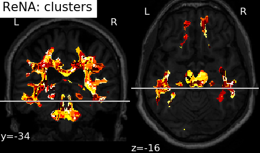
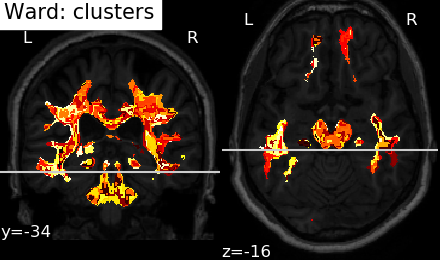
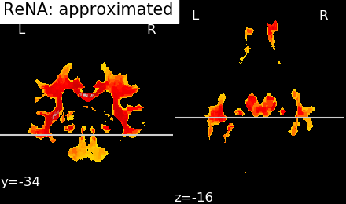
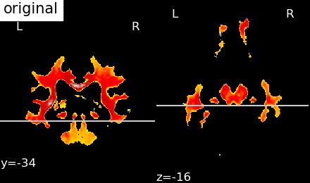

# lesion
---

## Introduction

This is an implement of recursive nearest agglomeration ([ReNA](https://github.com/ahoyosid/ReNA)).

## Function and Examples

#### Loading the data

Import ImplReNA from impl_rena.py, then state the class by the parameter of data folder address. And get the data information by data_info().

#### Get the connectivity (spatial structure)

Use get_connectivity() and return Time Ward and Time ReNA.

#### Custering and visualizing the results

Use visualizing. Return clusters rena figure, clusters ward figure, compress rena figure, compress ward figure and original figure.
Save the figures using storefig by the parameter of figures storing address. Return 

#### Example in test.py

```python
python test.py
```







## Dependencies

| Project | Version |
|---------|-------------|
| [python]       | 3.6 |
| [ReNA]         | 1.0 |
| [scikit-learn] | 0.15 |
| [nilearn]      | 0.2.4 |
| [nibabel]      | 1.1.0 |
| [numpy]        | 1.7.1 |
| [scipy]        | 0.15 |
| [matplotlib]   | 3.0.0 |

[python]: https://www.python.org/
[ReNA]: https://github.com/ahoyosid/ReNA
[scikit-learn]: http://scikit-learn.org/stable/
[nilearn]: https://nilearn.github.io/
[nibabel]: http://nipy.org/nibabel/
[numpy]: http://www.numpy.org/
[scipy]: https://www.scipy.org/
[matplotlib]:  https://matplotlib.org/